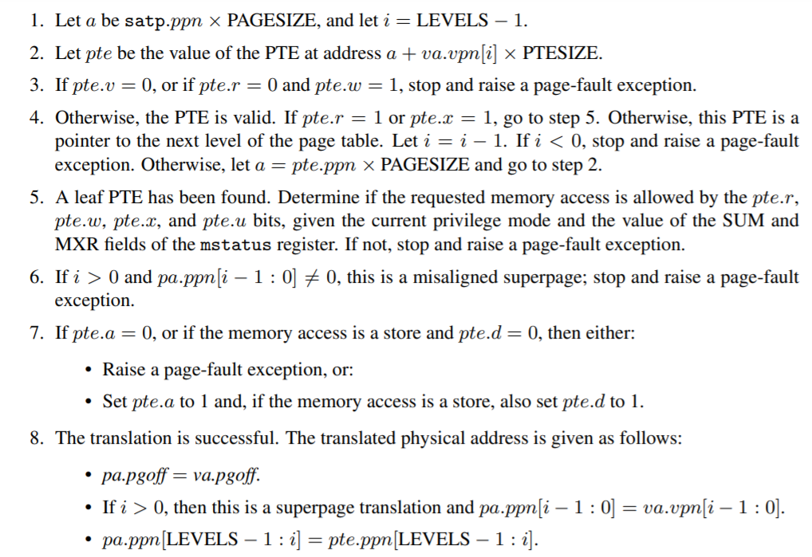
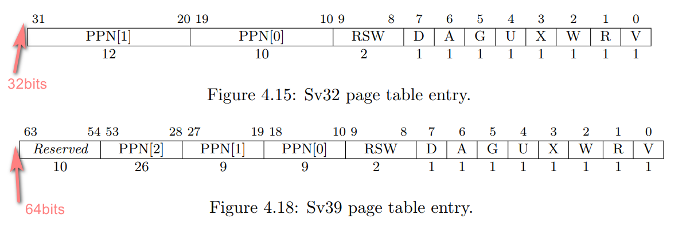
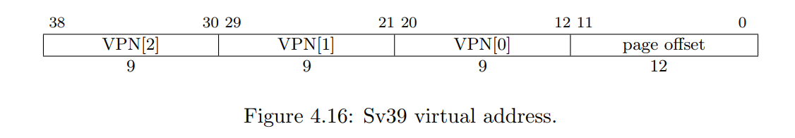
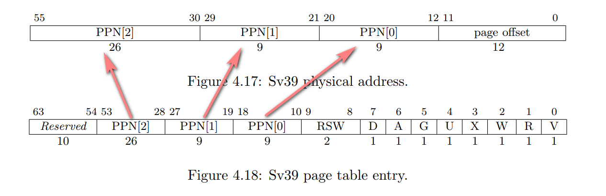
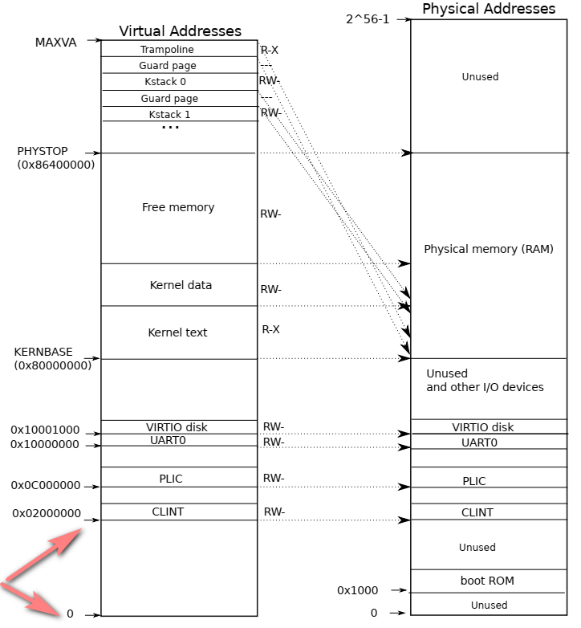
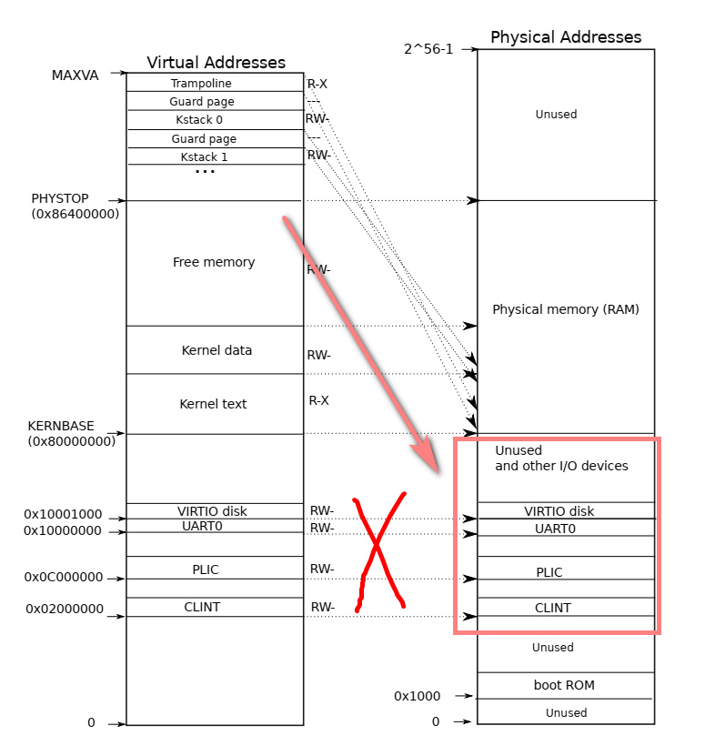

# Foreword

This lab is mainly used to familiar with the virtual memory mechanism. I would like to give the specification first, and then detail the behavior of each step.

The translation process is as follows:



`va` is the virtual address input and `pa` is the physical address output. The PAGESIZE constant is 2^12. For Sv32, LEVELS=2 and PTESIZE=4, whereas for Sv39, LEVELS=3 and PTESIZE=8.

First of all, `level` represents the number of levels of the page table, which is relatively intuitive. But what does `PTESIZE` mean? It is actually the size of the PTE itself. As shown in the figure below, the PTE structure of sv32 contains 32 bits, corresponding to 4 bytes, while the PTE structure of sv39 corresponds to 64 bits, corresponding to 8 bytes.



The second question is, what is `PPN` (physical page number) and `VPN`(visual page number) ? Here I would like to start with the translation process. For sv39, the virtual address will probably look like this:



You can see that there are three VPNs, and each VPN actually corresponds to an ***offset*** inside the page table.

First we look for the highest level PTE: `let pte be the value of the pte at address a + va.vpn[i] X PTESIZE`

```cpp
uint64 L2_pte = (uint64)a + (uint64)va.vpn[i] * 8 // PTESIZE == 8
```

Note that the 64-bit address is used, so it can be converted to an array form (for 64-bit length array elements, each element occupies 8 bytes):
```cpp
uint64 L2_pte_address = &a[ va.vpn[i] ];
```

Now you understand why I I call VPNs ***offsets***.
You may have such doubts: For different offsets, what is the corresponding form of va.vpn[i]?

The correct approach is to move each VPN to the lowest 9 digits:
```cpp
/*  if we have a virtual address like this:
va=   0b 111 000 000   000 111 000   000 000 111  0000 0000 0000
then,
va.vpn[2] = 0b 111 000 000
va.vpn[1] = 0b 000 111 000
va.vpn[0] = 0b 000 000 111
*/
bit_9_mask = 0b111111111;
va.vpn[0] = (va >> 12) & bit_9_mask;
va.vpn[1] = ( (va >> 12) >> 9 ) & bit_9_mask;
va.vpn[2] = ( ( (va >> 12) >> 9 ) >> 9 ) & bit_9_mask;
```

The above process is exactly what `PX(level, va)` does in xv6.


Now, we get a L2 PTE. Assuming that this PTE is valid and points to the next level page table (no a leaf node), then we can get the next level PTE:



`let a = pte.ppn X PAGESIZE`, that is equivalent to moving the PPN to the corresponding position of the physical address and setting the offset bit field to 0.
```cpp
#define PTE2PA(pte) (((pte) >> 10) << 12)
// There are various bit manipulation techniques to achieve this.
```

Next, get the page table address of L1:
```cpp
a = PTE2PA(*L2_pte_address);
```

The next step is to repeat the process. Eventually we will get a L0 PTE. If this page table is a valid leaf node, then the corresponding physical address is:
```cpp
#define bit12_offset_mask 0xFFF
uint64 offset = virtual_address & bit12_offset_mask;
uint64 physical_address = PTE2PA(*L0_pte_address) | offset;
```

That's all. We briefly discuss the page table mechanism that will be used in this lab, but we didn't actually discuss anything about flag bits, super-page, etc. In the following sections I may mention some related content, basically from my own understanding. See also the RISC-V manual for details.


# Print a page table

There are two usual forms of recursion, one is recursion depth control for the RISC-V Level 3 page table which is only judged by `PTE_V` bit.

Another approach is the one I implemented, which is actually the idea of `freewalk`. We can distinguish internal nodes from leaf nodes by the bit field `PTE_R|PTE_W|PTE_X`. This method is also mentioned in the RISC-V manual.

> In fact, this method is a simple prototype when RISC-V uses super-pages

```cpp
if ((pte & PTE_V) && (pte & (PTE_R|PTE_W|PTE_X)) == 0) {
    // internal node
}
else if ((pte & PTE_V) && (pte & (PTE_R|PTE_W|PTE_X)) != 0) {
    // leaf node

    // For the sake of brevity, this is slightly different from the RISC-V specification,
    // and you can implement your own specification-compliant behavior.
}
```

Which method you actually use is a matter of opinion.

# A kernel page table per process && Simplify copyin/copyinstr

> `make grade` can take quite a long time. You can go to the system and run `echo hi` first to see if it works.

These two parts actually solve the same problem: enable the kernel to access user space and kernel space at the same time without switching page tables, while users can only access their own user space.

We noticed that the user space starts at address 0x0:



If we do not change the mapping in other places, then we can use the CLINT space at most.

Furthermore, if we don't use the direct mapping method for IO device, then we can at least use the address of 0x80000000 (KERNELBASE).

The most important thing we need to do is to find a correct place to place the user's page table. We can start with the highest level (L2) pagetable:
```cpp
  // 000 000 000       000 010 000     000 000 000     0000 0000 0000   -> 0x02000000(CLINT)
  // |   L2    |       |    L1   |     |  L0     |     | 12bit offset |
```

For a high address like CLINT, its L2 is still 0. Therefore, we can think that the L2 of the user space is all 0.

We can create a `kernel_pagetable`, for `kernel_pagetable[0]`, it corresponds to the first PTE, pointing to user space, and for the remaining 511 PTEs, just copy the PTE of the original kernel space.

After solving the problem of where to store the page tables, it is time to consider how to release them. As mentioned above, the PTE of user space is `kernel_page[0]`. Then, find the L1 pagetable, and release the valid page table.


The last issue is how to monitor changes to the user page table and update the kernel page table in parallel. You may find that there are many functions that will affect the user page table, such as `exec`, `sbrk`, `fork`. But in essence, in xv6, the only case where the page table changes is the memory size:
```cpp
struct proc {
...
  uint64 sz;  // Size of process memory (bytes)
...
};
```

So, we just need to see when the memory size of the process has changed and map it accordingly. If memory is increased, then we need to copy the new PTE (and remove `PTE_U` so that it is accessible in S mode); if memory is decreased, then we may need to set the corresponding page to invalid.


# One more step

### address space

The problem that we can intuitively sense is that, there is too little memory available in user space.

We found that IO devices with low addresses take up a lot of space, so one solution is to map them to high address space instead of using direct-map.



### super-page

Use super-pages to reduce the number of PTEs in page tables. This requires you to further understand the complete mechanism of RISC-V address translation.

### Unmap the first page

Unmap the first page of a user process so that dereferencing a null pointer will result in a fault. You will have to start the user text segment at, for example, 4096, instead of 0.

Some knowledge of the ELF format may be required, which will become easier to achieve after completing the later courses.
