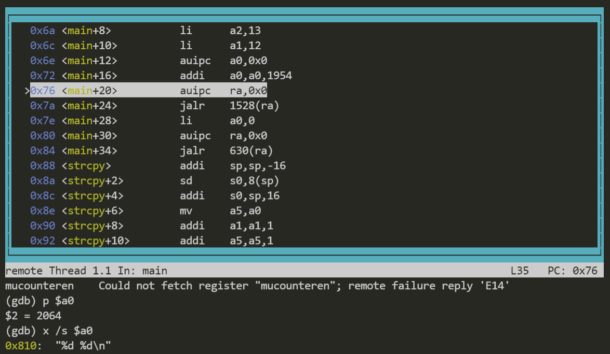
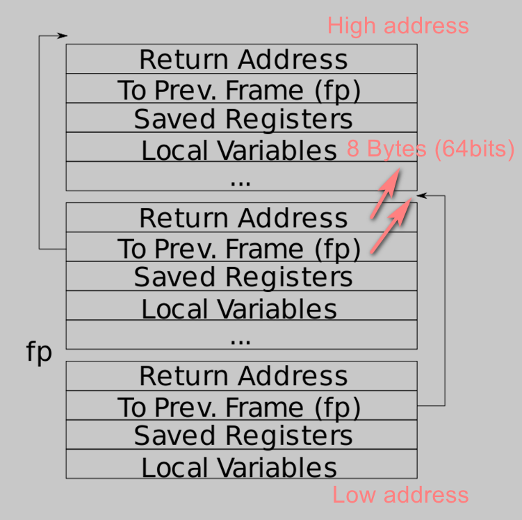

# Foreword
This lab is used to get familiar with the stack framework structure, the call conventions and the actions the kernel should take when a trap occurs.

GDB is your friend. With GDB this lab will become easier.


# RISC-V assembly

Here, I will use GDB to illustrate these issues.

1. **Which registers contain arguments to functions?**
2. **Where is the call to function f in the assembly code for main? Where is the call to g?**



You can see that `a0`, `a1`, `a2`  store each of the three parameters of `printf`.
`a0` : `"%d %d\n"`
`a1` : `12`
`a2` : `13`

> See: Calling Conventions and Stacking Framework RISC-V

You will find that the calls to functions `f` and `g` are already inlined by the compiler, so `a1` and `a2` are calculated results.

Looking at `call.asm` helps us further understand function calls:
```cpp
int f(int x) {
   e:	1141                	addi	sp,sp,-16  ===> Stack allocation
  10:	e422                	sd	s0,8(sp)   ===> Save s0(fp) on the stack
  12:	0800                	addi	s0,sp,16   ===> s0(fp) now points to the pre-allocation stack
  return g(x);
}
  14:	250d                	addiw	a0,a0,3     ===> x += 3
  16:	6422                	ld	s0,8(sp)    ===> Recover s0(fp)
  18:	0141                	addi	sp,sp,16    ===> Recover stack
  1a:	8082                	ret                 ===> return
```

3. **At what address is the function printf located?**
4. **What value is in the register ra just after the jalr to printf in main?**


Here, we focus on jalr and auipc:
- `auipc`: auipc rd, immediate  <===> x[rd] = pc + sext(immediate[31:12] << 12) ----> Adds the sign-extended 20-bit immediate, left-shifted by 12 bits, to the pc, and writes the result to x[rd].
- `jalr`: jalr rd, offset(rs1)  <===> t =pc+4; pc=(x[rs1]+sext(offset))&∼1; x[rd]=t ----> Sets the pc to x[rs1] + sign-extend(offset), masking off the least-significant bit of the computed address, then writes the previous pc+4 to x[rd]. If rd is omitted, x1 is assumed.


```cpp
void main(void) {
  2c:	1141                	addi	sp,sp,-16
  2e:	e406                	sd	ra,8(sp)
  30:	e022                	sd	s0,0(sp)
  32:	0800                	addi	s0,sp,16
  printf("%d %d\n", f(8)+1, 13);
  34:	4635                	li	a2,13
  36:	45b1                	li	a1,12
  38:	00000517          	auipc	a0,0x0 ===> a0 = PC
  3c:	7a850513          	addi	a0,a0,1960 # 7e0 <malloc+0xea> ===> a0 = addressOf("%d %d\n")
  40:	00000097          	auipc	ra,0x0 ===> ra = PC
  44:	5f8080e7          	jalr	1528(ra) # 638 <printf>
  exit(0);
  48:	4501                	li	a0,0
  4a:	00000097          	auipc	ra,0x0
  4e:	276080e7          	jalr	630(ra) # 2c0 <exit>
```

5. **What is the output?**

```cpp
unsigned int i = 0x00646c72;
printf("H%x Wo%s", 57616, &i);
```

RISC-V is little-endian. For `i` it will print like this:

```cpp
i = 0x00  64   6c  72
      |   |    |   'r'
      |   |   'l'
      |  'd'
    '\0'
(High Address)<---------(Low Address) Order of printing

output: rld
```


6. **In the following code, what is going to be printed after 'y='? (note: the answer is not a specific value.) Why does this happen?**

```cpp
printf("x=%d y=%d", 3);
```

Depends on the value of register `a1`, and it will be uncertain in this example.


# Backtrace


Let's start by looking at the structure of the stack. With the help of GDB we can get a clearer picture of the memory layout.



At first, I added breakpoints to the `sys_sleep` function, but that was a little short of success.
Then, I created a blank backtrace function and added a breakpoint to it.

With GDB, we can easily know the memory layout. These are a few of the gdb commands I use:

```bash
# add breakpoint
b backtrace

# view register
info reg

# print memory in 8 byte length, hexadecimal
x/1000xg 0x3fffff9f90
```

Some of the memory layouts are as follows:

```cpp
0x3fffff9f70:   0x0000003fffff9fc0  (pfp)    0x0000000080002cee (return address 1)
0x3fffff9f80:   0x0000003fffff9fc0 (fp1)     0x00000001ffff9fa0
0x3fffff9f90:   0x0000003fffff9fc0      0x0000000000000020
--Type <RET> for more, q to quit, c to continue without paging--
0x3fffff9fa0:   0x0000000087f64000      0x0000000080012038
0x3fffff9fb0:   0x0000003fffff9fe0 (pfp2)     0x0000000080002b52 (return address 2)
0x3fffff9fc0:   0x0000000000000063 (fp2)     0x0000000080012038
0x3fffff9fd0:   0x0000003fffffa000 (pfp3 ->end)     0x000000008000283c (return address 3)
0x3fffff9fe0:   0x0000000000000063 (fp3)     0x0000000000013f50
0x3fffff9ff0:   0x0000000000002fe0      0x0000000000000012
0x3fffffa000:   Cannot access memory at address 0x3fffffa000
```

In the programming, we first get the value `fp1` (indicates the first frame pointer we get).
With the help of `fp1`, we can get the return address and the pointer to the previous frame pointer (pfp).

We know that the stack here is growing towards the lower address. The newest stack has a lower address, while the older stack has a higher address.

In summary, when we backtrack the older stacks, we will get higher addresses, which gives the stop condition: reaching the top (high address) of the page table.


# Alarm

You can get tips on the lab page, and here are some of my personal insights.

## test0

Our goal is to be able to call the functions specified by the user after entering the user space.

We can focus on the PC register and modify the value of the PC register to the corresponding callback function address. Notice that when the trap occurs, there will be a process of saving and restoring the PC registers (for user space), we just need to backup the saved PC register values and modify it to the values we want.


## test1/test2

In the previous process, we have saved the corresponding PC register values, and an intuition is to follow the same method to restore the PC registers.

However, I found that this did not work properly. I tried to relate it to the backtrace lab, and even considered how to recover the associated stack.

Here I actually over-complicated the issue. As stated in the lecture, `usertrap` simply saves all registers in userspace and restores them, and no assumptions need or should be made about how userspace uses registers.

In summary, we just need to save the `trapframe` and restore it, just like usertrap has done.

There are also some details that are difficult to notice like prevent re-entrant calls, but I think a clear understanding of what usertrap does and why it does it is the key to this lab.
