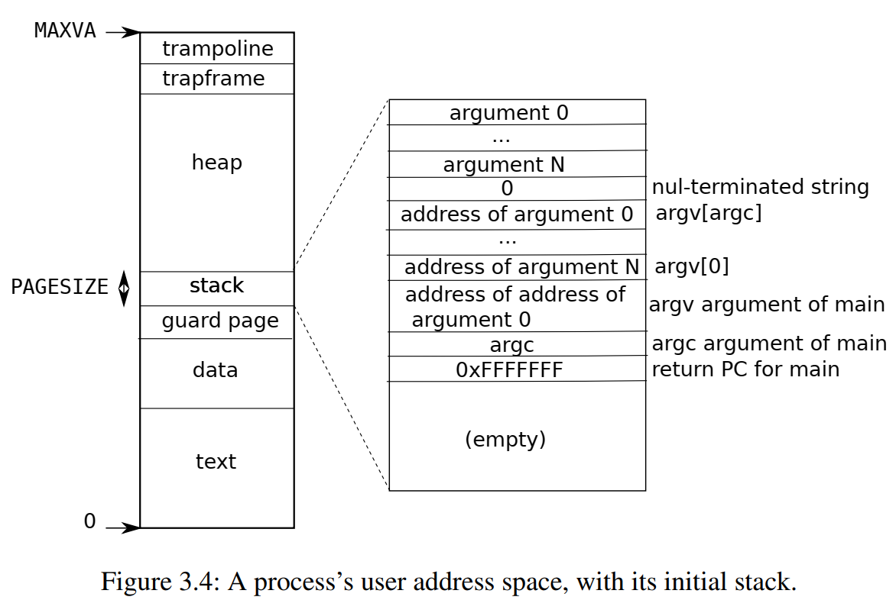

# Foreword

The difficulty of this lab lies in the various details. In the remaining chapters, I will step through the key points to consider in this experiment :

1. sbrk strategy
2. when will the allocation be made and how to do that
3. other details


# Sbrk Strategy

In this lab, all operations will revolve around `sbrk`. We know that `sbrk` is used to manage the size of user memory space, which can grow or decrease, corresponding to the `uvmalloc` and `uvmdealloc` functions.

- `uvmalloc`: Allocate user space and create a mapping of its virtual addresses to physical addresses
- `uvmdealloc`: Release virtual address to physical address mapping

Our goal is "lazy allocation", which means that no memory is allocated when the user requests additional memory. We just need to change the memory size in the process struct and remove the `uvmalloc` call. As for the work done by `uvmalloc`, we will discuss it later.

How about `uvmdealloc`? What should we do when the parameter of sbrk is negative? Is there also a so-called lazy release operation? If you think about it, you will see that this means reclaiming some of the memory, whether it is already allocated or not. If the corresponding memory has not been allocated yet, that's fine, but if it has been allocated, then it can't be used anymore and should be release immediately instead of delaying the operation. A simple and straightforward solution is to leave `uvmdealloc` unchanged.

# Allocation timing

In the previous discussion, we have deferred the time of action of `uvmalloc`, and we will discuss this point in depth below.

We know that the allocation operation is only required when accessing unallocated memory. You may quickly think about the content of the page fault, but the access operation may occur in the following two situations:

1. User space, for the user process to read and write by itself
2. Kernel space, for access operation of the kernel to user space memory

This classification is based on page table, since the original xv6 used different page tables for user space and kernel space.

In user space, access to unallocated memory will cause a trap, so we need to handle it in the trap handle. In kernel space, operations on user memory often come from system calls. In particular, they are functions like `copyout`, `copyin` and `copyinstr` that we are already familiar with in the system call lab.


# Allocation process

Although the timing of the allocation may be numerous, the process of allocation is largely consistent. We'll do the same thing as `uvmalloc` :

1. Allocate an empty block of physical memory
2. Create a mapping of virtual addresses to physical addresses and set the appropriate flags.

The following is the core code of `uvmalloc` :

```cpp
mem = kalloc(); // Finding free physical memory
if(mem == 0){ // out of memory!
    // error handle...
    return 0;
}

// Necessary initialization operation
memset(mem, 0, PGSIZE);

// Create a mapping of virtual addresses to physical addresses and set the appropriate flags.
if(mappages(pagetable, a, PGSIZE, (uint64)mem, PTE_W|PTE_X|PTE_R|PTE_U) != 0){ // map failed!
    kfree(mem);
    // error handle...
    return 0;
}
```

Basically, we just need to steal the code for `uvmalloc` and use it when appropriate.

# Other Details...

There are a lot of annoying details, a few will be briefly introduced below:

## Address Check

When the user tries to use an invalid address, the kernel does something simple: it kills the process. If you've looked at the code for `trap.c`, you can do this relatively easily:

```cpp
struct proc *p = myproc(); // get the current process
p->killed = 1; // set the flags and someone else will do the rest.
```

Here comes the point, how do you check that the user has provided a valid address? We need to start with the user's address space:



1. The address accessed cannot exceed the size of the allocated address space, do not forget that the user space address starts from `0x0`.
2. Notice that the layout of xv6's user space is somewhat unusual in that the stack is located at a lower address and there are guard page at the bottom of the stack. Access to the guard page is not allowed.

> There is another potential problem here, but it may not have been tested. We want lazy allocation to be able to allocate as many addresses as possible, but there is a limit to this. Notice that the high address are already occupied by the trapframe, and the allocated space should not exceed the trapframe.

## PTE Flag

You need to consider the PTE flags carefully, especially the `PTE_U`. An unreasonable flag setting will lead to potential problems in the map and free process.

## Memory Copy - fork

In the original version, we always allocate the required memory space, and for `fork` it is a simple matter of copying it.

In the lazy allocation version, we do not allocate memory immediately, and the memory that has been allocated may be discontiguous, both for virtual and physical addresses.

fork's copy operations for memory are done by `uvmcopy`. The validity of the PTE may be checked during this process and is invalid for unassigned addresses. We can take some simple actions to ignore the check for unallocated space.

# Memory Free

The memory release process is somewhat similar to `fork` in that it removes the mapping of virtual addresses to physical addresses. This mapping relationship does not exist for unallocated memory, and again, you need to ignore them.

